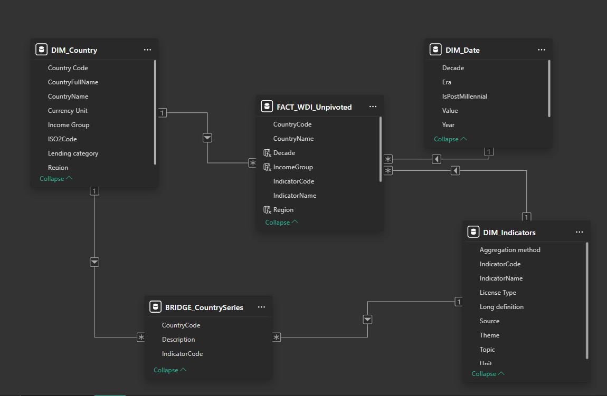
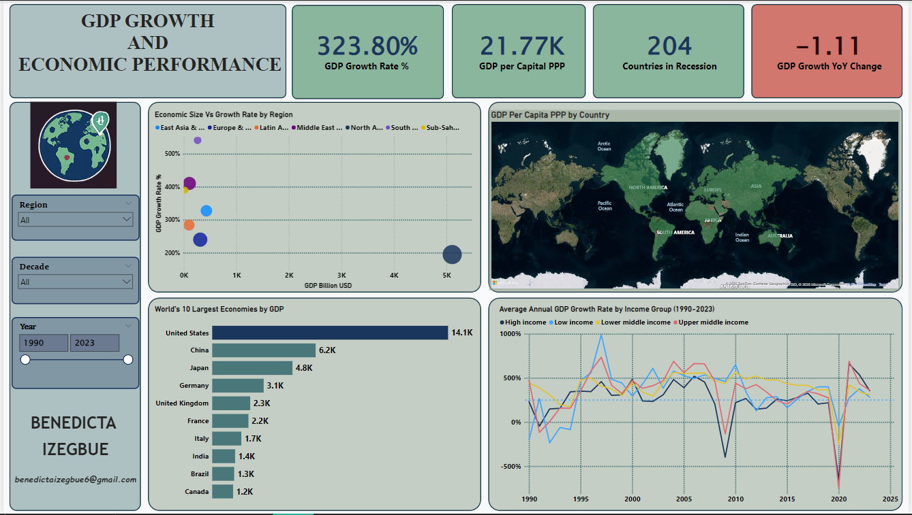
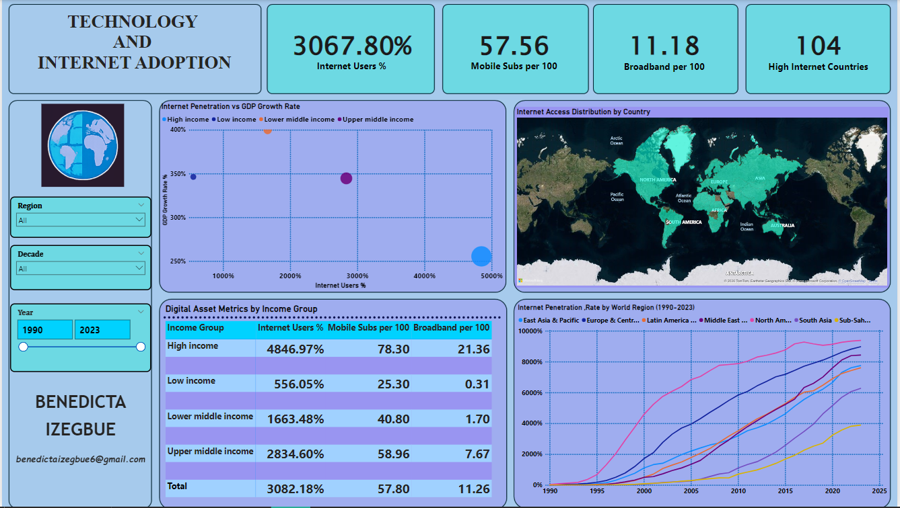

## World Development Indicators (WDI) Project

## GDP Growth & Economic Performance | Technology & Internet Adoption

A comprehensive project built using the World Bank World Development Indicators (WDI) dataset to analyze global economic performance and digital technology adoption across countries from 1990–2023.

The project explores how economic growth and digital connectivity have evolved over time and investigates the relationship between national wealth, internet access, mobile connectivity, and broadband infrastructure. By combining economic and technology indicators into one analytical model, the dashboard provides meaningful insights into global development patterns and inequalities.

---

## Project Overview
Global development extends beyond economic output. It also depends on how effectively countries adopt and leverage technology.

This project focuses on two key development themes:
•	GDP Growth & Economic Performance
•	Technology & Internet Adoption

Using official World Bank data, the dashboard enables users to compare countries, regions, and income groups while identifying long-term trends in economic growth and digital transformation.

---

## Problem Statement
The project explores two major development themes using the World Development Indicators dataset:

### 1. GDP Growth & Economic Performance
Examines:
•	Economic size
•	GDP growth
•	GDP per capita
•	Economic inequality
•	Recession trends

### 2. Technology & Internet Adoption
Evaluates:
•	Internet usage
•	Mobile subscriptions
•	Broadband penetration
•	Digital inclusion across income groups

The objective is to uncover global development patterns while highlighting disparities between countries and income groups.

---

## Dataset Information

### Source
•	World Bank World Development Indicators (WDI)

### Coverage
•	1990 – 2023

### Data Completeness
•	Approximately 80–97% depending on the selected indicator.

### Selected Indicators

| Indicator | Code |
|---|---|
| GDP (Current US$) | NY.GDP.MKTP.CD |
| GDP Growth (Annual %) | NY.GDP.MKTP.KD.ZG |
| GDP per Capita (PPP) | NY.GDP.PCAP.PP.KD |
| GDP per Capita Growth | NY.GDP.PCAP.KD.ZG |
| Internet Users (% Population) | IT.NET.USER.ZS |
| Mobile Subscriptions (per 100 People) | IT.CEL.SETS.P2 |
| Fixed Broadband Subscriptions (per 100 People) | IT.NET.BBND.P2 |

These seven indicators were selected because together they provide a comprehensive picture of both economic development and digital transformation.

---

## Tools & Technologies
•	Microsoft Power BI
•	Power Query
•	DAX
•	World Bank WDI Dataset
•	Star Schema Data Modeling

---

## Data Cleaning & Preparation
The raw WDI dataset required significant transformation before analysis.

The cleaning process included:
•	Removing empty columns
•	Removing aggregate regions (World, OECD, etc.)
•	Standardizing income group categories
•	Converting the dataset from wide format to long format
•	Filtering observations between 1990–2023
•	Excluding forecast years (2024–2025)
•	Creating Theme, Region, Income Group and Decade columns
•	Removing null values
•	Optimizing the dataset for Power BI performance

---

## Data Model
The project follows a Star Schema, which is considered the industry standard for analytical reporting.

### Fact Table
•	FACT_WDI

### Dimension Tables
•	Country
•	Indicators
•	Date

### Model View
S

This model improves:
•	Query performance
•	Scalability
•	Filtering efficiency
•	Time intelligence analysis

---

## Dashboard KPIs

### GDP & Economic Performance
•	Global GDP Growth Rate
•	GDP per Capita (PPP)
•	GDP Growth YoY Change
•	Countries in Recession

### Technology Adoption
•	Internet Users (%)
•	Mobile Subscriptions per 100 People
•	Broadband Subscriptions per 100 People
•	Countries with High Internet Penetration

---

## Dashboard Visualizations

---

### GDP Growth & Economic Performance

---

### Technology & Internet Adoption

---

## Analytical Use Cases

### A. GDP Growth & Economic Performance
#### Key Findings
•	Global GDP growth averaged 2.5%.
•	204 countries experienced recession at some point during the analysis period.
•	The United States (21.77 trillion USD) and China (4.1 trillion USD) dominate global economic output.
•	Smaller economies frequently experience faster growth than larger economies.

#### Insights
•	High-income countries generally experience slower but more stable growth.
•	Lower-income countries demonstrate higher growth potential but greater economic volatility.
•	GDP per capita reveals that the world's largest economies are not necessarily the wealthiest per person.

#### Recommendations
•	Promote inclusive economic growth alongside GDP expansion.
•	Monitor recession-prone countries as early indicators of global economic instability.
•	Focus development policies on sustainable long-term growth rather than GDP size alone.

---

### B. Technology & Internet Adoption
#### Key Findings
•	Internet usage increased by 3,067.8% between 1990 and 2023.
•	High-income countries achieved 4,846.97% growth in internet adoption.
•	Low-income countries recorded only 556.05% growth.
•	Broadband penetration remains highly unequal:
o	High-income countries: 21.36 subscriptions per 100 people
o	Low-income countries: 0.31 subscriptions per 100 people

#### Insights
•	Significant digital inequality still exists.
•	Mobile connectivity has expanded rapidly worldwide.
•	Broadband infrastructure remains the strongest indicator of digital maturity.
•	Countries with greater internet access generally exhibit stronger economic and social development.

#### Recommendations
•	Expand broadband infrastructure in low-income countries.
•	Adopt mobile-first strategies where broadband deployment is limited.
•	Invest in digital literacy alongside digital infrastructure.

---

## Key Insights

### Economic Growth
•	Larger economies dominate global GDP.
•	Smaller economies often experience faster growth.
•	GDP per capita provides a more accurate measure of living standards than GDP alone.

### Technology Adoption
•	Global internet adoption has grown dramatically.
•	Broadband remains unevenly distributed.
•	The digital divide continues to limit opportunities in low-income countries.

## Cross-Theme Insight
One of the most significant findings is the strong relationship between technology adoption and economic performance. Countries with higher internet penetration generally demonstrate stronger development outcomes, reinforcing the importance of digital infrastructure in sustainable economic growth.

---

## Conclusion
The dashboard demonstrates that sustainable development depends on both economic progress and digital inclusion.
While major economies continue to dominate global output, many developing countries possess significant growth potential despite economic volatility.

Similarly, although internet adoption has expanded worldwide, broadband accessibility remains highly unequal across income groups.

Bridging the digital divide while promoting inclusive economic growth should remain a priority for governments, policymakers, and international development organizations.

---

## Repository Structure

## World-Development-Indicators-Projects
│
├── Images
│   ├── GDP_Dashboard.png
│   ├── Technology_Dashboard.png
│   └── Model_View.png
│
├── Power BI Dashboard
│   └── WDI Dashboard.pbix
│
├── Documentation
│   └── Project Report.pdf
│
└── README.md

---

## Skills Demonstrated
•	Data Cleaning
•	Data Transformation
•	Power Query
•	Data Modeling
•	Star Schema Design
•	DAX Measures
•	Time Intelligence
•	KPI Development
•	Dashboard Design
•	Data Visualization
•	Business Intelligence
•	Exploratory Data Analysis (EDA)
•	Economic Data Analysis
•	Technology Adoption Analysis

---

## Data Source

### World Bank – World Development Indicators (WDI)
https://databank.worldbank.org/source/world-development-indicators

---

## Author

## Benedicta Izegbue
Aspiring Data Analyst passionate about transforming complex datasets into actionable insights through Power BI, SQL, Excel, and Python.

